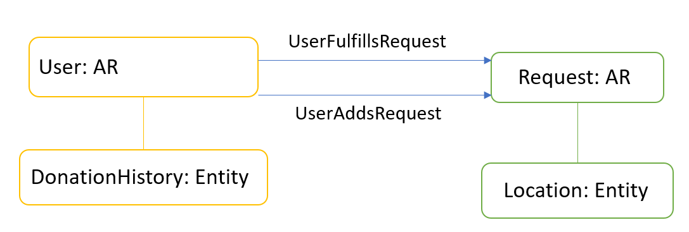
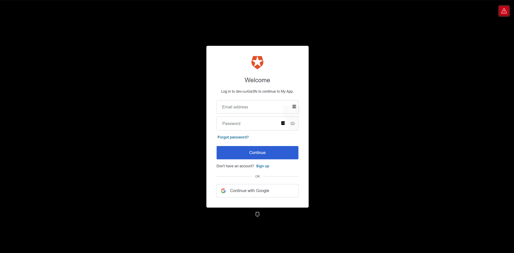
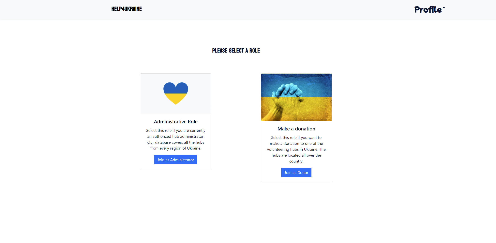
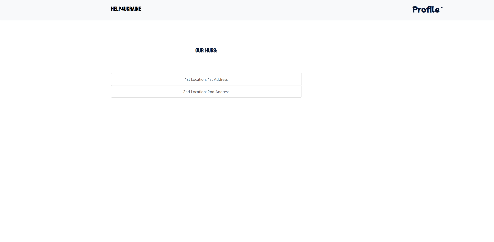
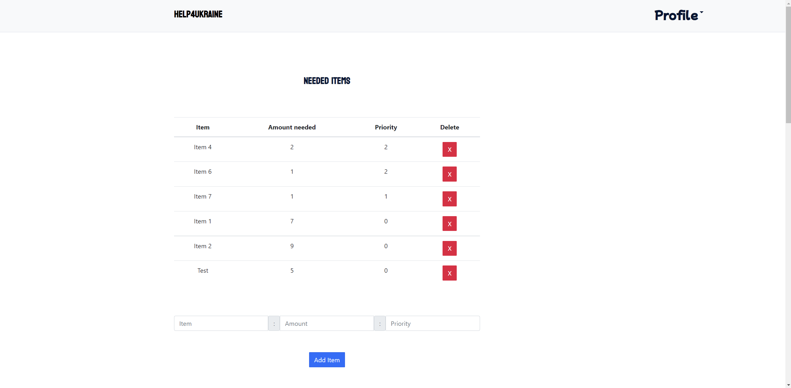
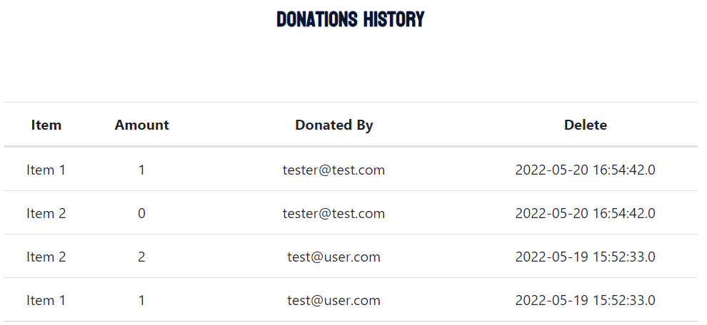
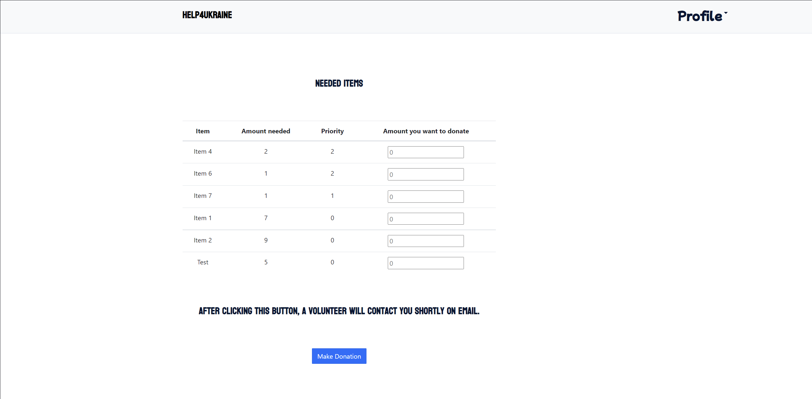
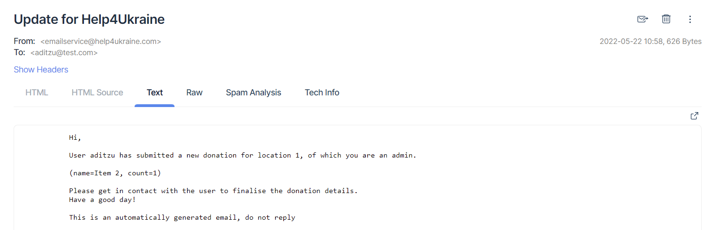

# Help4Ukraine Donations Website

## Keywords
`Java, Spring, JPA, REST, Docker, Angular, Message Queue, Python`

## Intro
This is a Web Application written as an assignment for "Web Programming". Its goal is to provide a way to centralise multiple donation centers, for admins to request donations and for users to donate the required items.

## Entities

## Technology stack
- docker-compose
- frontend: Javascript w/ Angular
- database: MySQL
- backend: Java Spring API (entities, repositories, services, DTOs, controllers)
- MQTT broker: low overhead and customizable way of dealing with incoming 
- email service: Python script, possible implementation of MQ subscriber, which sends out emails to admins of Locations which receive new donations
- Auth0: a service for implementing OAuth 2.0 authentication flows and social sign-in

## Running
- build the 3 custom Docker Images (backend, frontend, email service)
- configure environment variables for containers
- `docker-compose up`

## Screenshots

